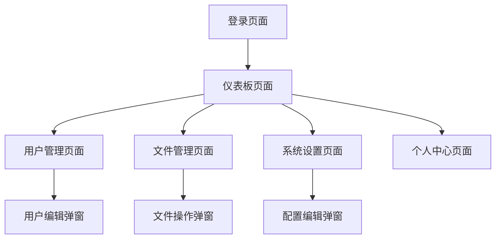

# 可视化后台服务器管理系统 - 产品需求文档

## 1. Product Overview

本产品是一个现代化的可视化后台服务器管理系统，为管理员提供直观、高效的服务器资源管理界面。
系统采用苹果设计语言，提供流畅的用户体验和优雅的视觉效果，主要解决服务器管理复杂性和用户体验不佳的问题。
目标是成为企业级服务器管理的首选解决方案，提升管理效率和用户满意度。

## 2. Core Features

### 2.1 User Roles

| Role | Registration Method | Core Permissions |
|------|---------------------|------------------|
| 超级管理员 | 系统初始化创建 | 拥有所有系统权限，包括用户管理、系统配置、文件管理等 |
| 普通管理员 | 超级管理员邀请创建 | 可管理用户信息、查看系统状态、进行文件操作 |
| 只读用户 | 管理员创建分配 | 只能查看系统信息和文件列表，无修改权限 |

### 2.2 Feature Module

我们的后台管理系统包含以下主要页面：
1. **登录页面**：用户身份验证、密码重置功能
2. **仪表板页面**：系统概览、实时监控数据、快捷操作入口
3. **用户管理页面**：用户列表、用户信息编辑、权限管理、用户状态管理
4. **文件管理页面**：文件浏览、上传下载、文件操作、存储管理
5. **系统设置页面**：系统配置、安全设置、日志管理
6. **个人中心页面**：个人信息管理、密码修改、操作历史

### 2.3 Page Details

| Page Name | Module Name | Feature description |
|-----------|-------------|---------------------|
| 登录页面 | 身份验证模块 | 用户登录验证、记住密码、忘记密码重置、多因素认证支持 |
| 仪表板页面 | 系统概览模块 | 显示服务器状态、CPU/内存使用率、在线用户数、存储空间统计 |
| 仪表板页面 | 快捷操作模块 | 提供常用功能快捷入口、最近操作记录、系统通知提醒 |
| 用户管理页面 | 用户列表模块 | 分页显示用户、搜索过滤、批量操作、用户状态切换 |
| 用户管理页面 | 用户编辑模块 | 创建新用户、编辑用户信息、分配角色权限、删除用户 |
| 文件管理页面 | 文件浏览模块 | 树形目录结构、文件列表视图、文件预览、路径导航 |
| 文件管理页面 | 文件操作模块 | 上传文件、下载文件、重命名、移动、复制、删除操作 |
| 文件管理页面 | 存储管理模块 | 存储空间统计、清理垃圾文件、备份管理 |
| 系统设置页面 | 配置管理模块 | 系统参数配置、安全策略设置、备份恢复配置 |
| 系统设置页面 | 日志管理模块 | 操作日志查看、系统日志分析、日志导出功能 |
| 个人中心页面 | 个人信息模块 | 修改个人资料、头像上传、联系方式更新 |
| 个人中心页面 | 安全设置模块 | 密码修改、登录设备管理、操作历史查看 |

## 3. Core Process

**超级管理员流程：**
超级管理员登录后进入仪表板，可以查看系统整体状态。通过用户管理模块创建和管理其他管理员账户，设置权限级别。在文件管理中可以进行所有文件操作，包括系统级文件的管理。通过系统设置配置全局参数和安全策略。

**普通管理员流程：**
普通管理员登录后同样进入仪表板查看被授权的系统信息。可以管理普通用户账户，但无法修改其他管理员权限。在文件管理中可以进行常规文件操作，但受到权限限制。可以查看部分系统设置但无法修改核心配置。

**只读用户流程：**
只读用户登录后只能查看仪表板的基本信息，浏览用户列表但无法编辑，查看文件列表但无法进行任何修改操作。

## 4. User Interface Design

### 4.1 Design Style

- **主色调**：#007AFF (苹果蓝)，辅助色：#34C759 (成功绿)、#FF3B30 (警告红)、#FF9500 (提醒橙)
- **按钮样式**：圆角矩形按钮，支持悬停和点击动画效果，遵循苹果Human Interface Guidelines
- **字体**：优先使用SF Pro Display，备选方案为苹方、PingFang SC，主要字号16px，次要信息14px，标题20px
- **布局风格**：卡片式设计，顶部导航栏，左侧边栏导航，内容区域采用网格布局
- **图标风格**：使用SF Symbols风格的线性图标，支持多种尺寸和权重

### 4.2 Page Design Overview

| Page Name | Module Name | UI Elements |
|-----------|-------------|-------------|
| 登录页面 | 身份验证模块 | 居中卡片布局，渐变背景，圆角输入框，蓝色主按钮，微动画反馈 |
| 仪表板页面 | 系统概览模块 | 网格卡片布局，实时数据图表，进度条动画，色彩编码状态指示器 |
| 仪表板页面 | 快捷操作模块 | 圆形图标按钮，悬停放大效果，毛玻璃背景，阴影层次 |
| 用户管理页面 | 用户列表模块 | 表格视图，斑马纹背景，搜索框，分页器，批量操作工具栏 |
| 用户管理页面 | 用户编辑模块 | 模态弹窗，表单验证，实时反馈，滑动切换开关 |
| 文件管理页面 | 文件浏览模块 | 双栏布局，树形导航，文件网格视图，面包屑导航 |
| 文件管理页面 | 文件操作模块 | 右键菜单，拖拽上传区域，进度条，操作确认对话框 |
| 系统设置页面 | 配置管理模块 | 分组表单，标签页切换，开关控件，滑块控件 |
| 个人中心页面 | 个人信息模块 | 头像上传区域，表单输入，保存按钮，成功提示动画 |

### 4.3 Responsiveness

系统采用桌面优先的响应式设计，支持1920x1080及以上分辨率的最佳体验。在较小屏幕上，侧边栏会自动折叠为图标模式，表格会启用横向滚动。支持触摸设备的基本交互，但主要针对鼠标和键盘操作进行优化。