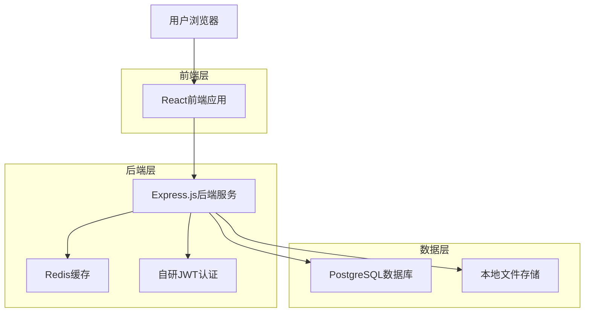
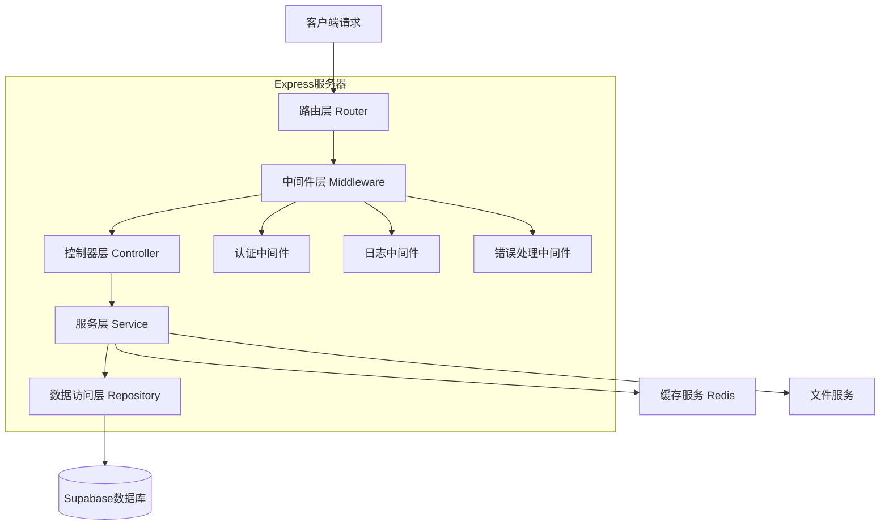
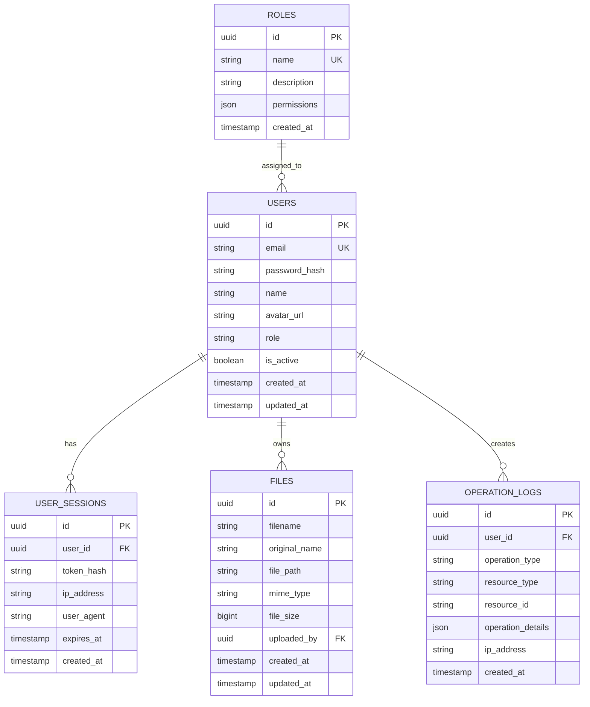

# 可视化后台服务器管理系统 - 技术架构文档

## 1. Architecture design



## 2. Technology Description

- Frontend: React@18 + TypeScript + Tailwind CSS + Framer Motion + Vite
- Backend: Express.js@4 + TypeScript + 自研JWT认证系统
- Database: PostgreSQL@15 + Prisma ORM（国产替代：TypeORM）
- Cache: Redis@7（本地部署）
- File Storage: 本地文件系统 + Multer（可选：七牛云、阿里云OSS）
- Security: bcrypt密码加密 + jsonwebtoken + helmet安全中间件
- UI Components: 自定义组件库（基于苹果设计语言）

## 3. Route definitions

| Route | Purpose |
|-------|---------|
| /login | 登录页面，用户身份验证和授权 |
| /dashboard | 仪表板页面，显示系统概览和快捷操作 |
| /users | 用户管理页面，管理系统用户和权限 |
| /users/:id | 用户详情页面，编辑特定用户信息 |
| /files | 文件管理页面，浏览和管理文件系统 |
| /settings | 系统设置页面，配置系统参数和安全策略 |
| /profile | 个人中心页面，管理个人信息和安全设置 |
| /404 | 404错误页面，处理未找到的路由 |

## 4. API definitions

### 4.1 Core API

**用户认证相关（自研JWT系统）**
```
POST /api/auth/register  # 用户注册
POST /api/auth/login     # 用户登录
POST /api/auth/logout    # 用户登出
POST /api/auth/refresh   # 刷新token
GET /api/auth/verify     # 验证token有效性
```

登录接口 Request:
| Param Name | Param Type | isRequired | Description |
|------------|------------|------------|-------------|
| email | string | true | 用户邮箱地址 |
| password | string | true | 用户密码（明文，后端bcrypt加密） |
| remember | boolean | false | 是否记住登录状态（影响token过期时间） |

登录接口 Response:
| Param Name | Param Type | Description |
|------------|------------|-------------|
| success | boolean | 登录是否成功 |
| accessToken | string | JWT访问令牌（短期有效） |
| refreshToken | string | 刷新令牌（长期有效） |
| user | object | 用户基本信息（不含密码） |
| permissions | array | 用户权限列表 |
| expiresIn | number | token过期时间（秒） |

Example:
```json
{
  "email": "admin@example.com",
  "password": "password123",
  "remember": true
}
```

**用户管理相关**
```
GET /api/users
POST /api/users
PUT /api/users/:id
DELETE /api/users/:id
```

**文件管理相关**
```
GET /api/files
POST /api/files/upload
DELETE /api/files/:id
GET /api/files/download/:id
```

**系统监控相关**
```
GET /api/system/status
GET /api/system/logs
```

## 5. Server architecture diagram



## 6. Data model

### 6.1 Data model definition



### 6.2 Data Definition Language

**用户表 (users)**
```sql
-- 创建用户表
CREATE TABLE users (
    id UUID PRIMARY KEY DEFAULT gen_random_uuid(),
    email VARCHAR(255) UNIQUE NOT NULL,
    password_hash VARCHAR(255) NOT NULL,
    name VARCHAR(100) NOT NULL,
    avatar_url TEXT,
    role VARCHAR(50) DEFAULT 'user' CHECK (role IN ('super_admin', 'admin', 'user')),
    is_active BOOLEAN DEFAULT true,
    last_login_at TIMESTAMP WITH TIME ZONE,
    login_attempts INTEGER DEFAULT 0,
    locked_until TIMESTAMP WITH TIME ZONE,
    created_at TIMESTAMP WITH TIME ZONE DEFAULT NOW(),
    updated_at TIMESTAMP WITH TIME ZONE DEFAULT NOW()
);

-- 创建索引
CREATE INDEX idx_users_email ON users(email);
CREATE INDEX idx_users_role ON users(role);
CREATE INDEX idx_users_created_at ON users(created_at DESC);
CREATE INDEX idx_users_is_active ON users(is_active);

-- 创建更新时间触发器
CREATE OR REPLACE FUNCTION update_updated_at_column()
RETURNS TRIGGER AS $$
BEGIN
    NEW.updated_at = NOW();
    RETURN NEW;
END;
$$ language 'plpgsql';

CREATE TRIGGER update_users_updated_at BEFORE UPDATE ON users
    FOR EACH ROW EXECUTE FUNCTION update_updated_at_column();
```

**用户会话表 (user_sessions) - JWT Token管理**
```sql
CREATE TABLE user_sessions (
    id UUID PRIMARY KEY DEFAULT gen_random_uuid(),
    user_id UUID REFERENCES users(id) ON DELETE CASCADE,
    refresh_token_hash VARCHAR(255) NOT NULL,
    access_token_jti VARCHAR(255) NOT NULL, -- JWT ID for access token
    ip_address INET,
    user_agent TEXT,
    device_info JSONB,
    is_active BOOLEAN DEFAULT true,
    expires_at TIMESTAMP WITH TIME ZONE NOT NULL,
    created_at TIMESTAMP WITH TIME ZONE DEFAULT NOW(),
    last_used_at TIMESTAMP WITH TIME ZONE DEFAULT NOW()
);

CREATE INDEX idx_user_sessions_user_id ON user_sessions(user_id);
CREATE INDEX idx_user_sessions_refresh_token ON user_sessions(refresh_token_hash);
CREATE INDEX idx_user_sessions_access_token_jti ON user_sessions(access_token_jti);
CREATE INDEX idx_user_sessions_expires_at ON user_sessions(expires_at);
CREATE INDEX idx_user_sessions_is_active ON user_sessions(is_active);
```

**文件表 (files)**
```sql
CREATE TABLE files (
    id UUID PRIMARY KEY DEFAULT gen_random_uuid(),
    filename VARCHAR(255) NOT NULL,
    original_name VARCHAR(255) NOT NULL,
    file_path TEXT NOT NULL,
    mime_type VARCHAR(100),
    file_size BIGINT NOT NULL,
    file_hash VARCHAR(64), -- SHA256文件哈希，用于去重
    storage_type VARCHAR(20) DEFAULT 'local' CHECK (storage_type IN ('local', 'qiniu', 'aliyun')),
    storage_url TEXT, -- 云存储URL
    is_public BOOLEAN DEFAULT false,
    uploaded_by UUID REFERENCES users(id) ON DELETE SET NULL,
    created_at TIMESTAMP WITH TIME ZONE DEFAULT NOW(),
    updated_at TIMESTAMP WITH TIME ZONE DEFAULT NOW()
);

CREATE INDEX idx_files_uploaded_by ON files(uploaded_by);
CREATE INDEX idx_files_created_at ON files(created_at DESC);
CREATE INDEX idx_files_mime_type ON files(mime_type);
CREATE INDEX idx_files_file_hash ON files(file_hash);
CREATE INDEX idx_files_storage_type ON files(storage_type);

CREATE TRIGGER update_files_updated_at BEFORE UPDATE ON files
    FOR EACH ROW EXECUTE FUNCTION update_updated_at_column();
```

**操作日志表 (operation_logs)**
```sql
CREATE TABLE operation_logs (
    id UUID PRIMARY KEY DEFAULT gen_random_uuid(),
    user_id UUID REFERENCES users(id) ON DELETE SET NULL,
    operation_type VARCHAR(50) NOT NULL,
    resource_type VARCHAR(50) NOT NULL,
    resource_id VARCHAR(255),
    operation_details JSONB,
    ip_address INET,
    user_agent TEXT,
    request_id VARCHAR(255), -- 请求追踪ID
    status VARCHAR(20) DEFAULT 'success' CHECK (status IN ('success', 'failed', 'pending')),
    error_message TEXT,
    created_at TIMESTAMP WITH TIME ZONE DEFAULT NOW()
);

CREATE INDEX idx_operation_logs_user_id ON operation_logs(user_id);
CREATE INDEX idx_operation_logs_created_at ON operation_logs(created_at DESC);
CREATE INDEX idx_operation_logs_operation_type ON operation_logs(operation_type);
CREATE INDEX idx_operation_logs_status ON operation_logs(status);
CREATE INDEX idx_operation_logs_request_id ON operation_logs(request_id);
```

**初始数据**
```sql
-- 插入超级管理员账户（密码：admin123456）
INSERT INTO users (email, password_hash, name, role) VALUES 
('admin@system.com', '$2b$10$N9qo8uLOickgx2ZMRZoMye.IjPeR.nJ.BjNIP6UpC83wpe/EUMSDK', '系统管理员', 'super_admin');

-- 插入示例用户（密码：user123456）
INSERT INTO users (email, password_hash, name, role) VALUES 
('user@example.com', '$2b$10$N9qo8uLOickgx2ZMRZoMye.IjPeR.nJ.BjNIP6UpC83wpe/EUMSDK', '普通用户', 'user');
```

## 7. 国内开源替代方案推荐

### 7.1 数据库ORM选择
- **Prisma**：现代化的数据库工具包，类型安全，支持迁移和可视化
- **TypeORM**：国内广泛使用的TypeScript ORM，功能完善
- **Sequelize**：成熟稳定的Node.js ORM，社区活跃

### 7.2 云服务替代方案
- **文件存储**：七牛云、阿里云OSS、腾讯云COS
- **数据库**：阿里云RDS、腾讯云数据库、华为云RDS
- **缓存服务**：阿里云Redis、腾讯云Redis

### 7.3 自主开发优势
- **数据安全**：完全掌控数据，符合国内数据安全法规
- **成本控制**：避免国外服务的汇率波动和服务费用
- **技术自主**：不依赖第三方服务，可根据需求定制
- **合规性**：满足国内企业的合规要求
- **维护性**：团队完全掌握技术栈，便于长期维护

### 7.4 安全加固建议
- 使用bcrypt进行密码加密（salt rounds >= 12）
- JWT token设置合理的过期时间（access token: 15分钟，refresh token: 7天）
- 实施登录失败锁定机制（5次失败锁定30分钟）
- 添加请求频率限制（rate limiting）
- 使用helmet中间件增强HTTP安全
- 定期轮换JWT密钥
- 实施HTTPS强制跳转